# Change log

## vNext (?)
- Fixed presentation issues with grouped search results
- Added name filtering in advanced search window

## 0.0.9.1 (2019/02/02)

- Added skill categories filtering 
    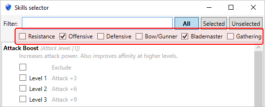
    - You can select multiple categories, showing all skills that are in at least one of those categories
    - Selecting no category or all categories has the same effect of showing all skills

## 0.0.9 (2019/01/30)

- Search results grouping 
    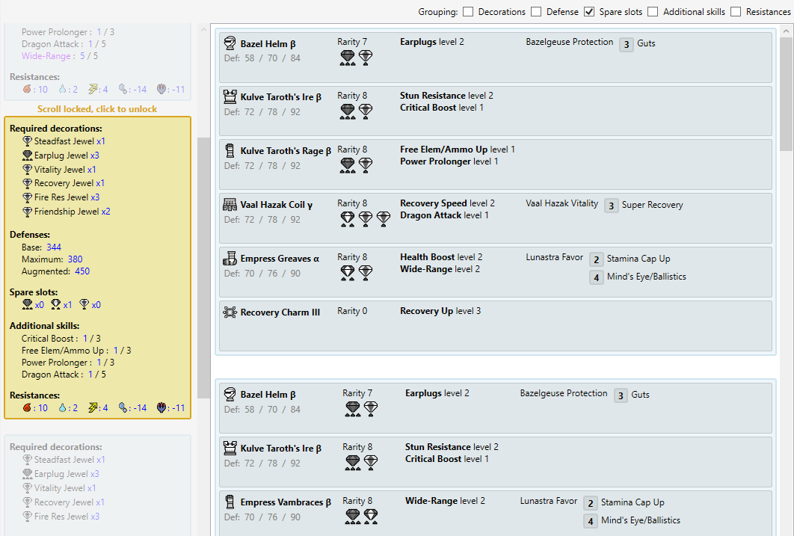
- Improved armor pieces selection based on slots
- Fixed armor pieces data
    - Kulve Taroth armor pieces had wrong elemental resistance values
    - Previously failed to import Drachen Vambraces α
- Added Gala Suit armor for save import reference

## 0.0.8.6 (2019/01/07)

- Fixed decorations import issue (introduced with localization in version 0.0.8.4)

## 0.0.8.5 (2019/01/07)

- Fixed localization issues (armor skill set names in search results)
- Now weapon slots in screenshots display *none* when there is no slot selected
- Fixed `System.ValueTuple` loading issue
- Improved equipment selection for search results

## 0.0.8.4 (2019/01/06)

- Now game data are localized in English, French, Japanese, Italian, German, Korean and Chinese
    - Note that Armory remains in English, language of game data only can be changed
    - Skills description data is missing, currently available only in English
- Now weapon slots are saved in the skill loadouts, and included in screenshots

## 0.0.8.3 (2018/12/22)

Note that 0.0.8.2 has been skipped, it was an experimental build distributed to testers for debug purpose only.

- Added Orion and Orion alpha armor pieces
- Fixed Kulve Taroth armor pieces defense based on user report
- Fixed issue related to crashes when loading of System.Net.Http version 4.2.0.0
- Fixed wrong gender processing for armor pieces selection
- Decorations override and equipment override windows are not modal anymore
- Added Drachen armor pieces to game equipment data (for save data import matching)

## 0.0.8.1 (2018/12/13)

- Added select all and unselect all buttons to the equipment override window
- Improved performance of the search algorithm (pure computational part) by 45%, almost twice faster than before

## 0.0.8 (2018/12/02)

- Added another condition to select candidate equipment for the search algorithm
    - Note that this may slow down searches that were previously faster

- For PC players, you can now import equipments from your save data! 
    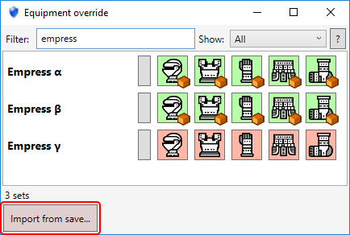

    It works like the jewels import feature, if you have more than one save data slot, a selector shows up for you to choose where to import from.

- Removed the event menu and window, since now it is much easier and more efficient to choose equipments to include or exclude via the equipment override window.

## 0.0.7.3 (2018/11/14)

- Added skill exclusion feature, based on [user suggestion](https://github.com/TanukiSharp/MHArmory/issues/2) 
This comes in very handy in specific cases where you want to exclude a skill because it is mutually exclusive with another. 

    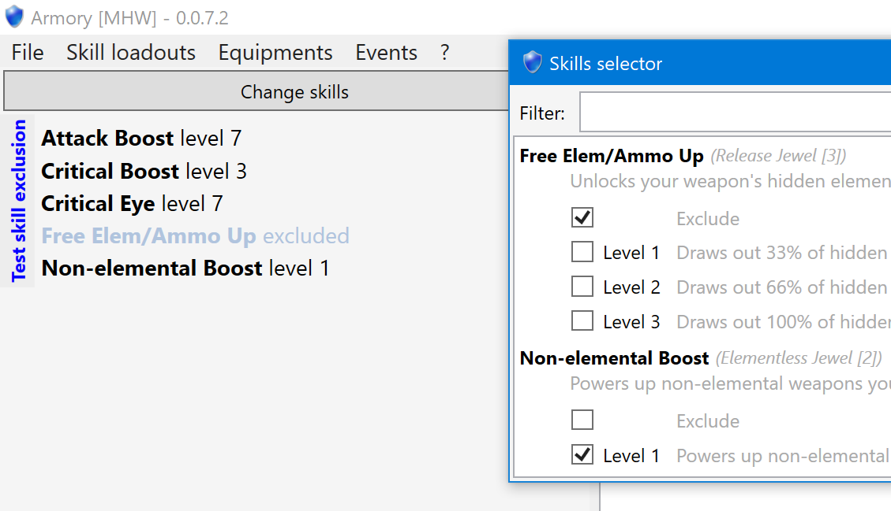

- Added equipment override window 
You can now indicate the equipment pieces you do not own in order to exclude them from armor set search. 
The window comes with some good filtering to help you easily find what you look for. 

    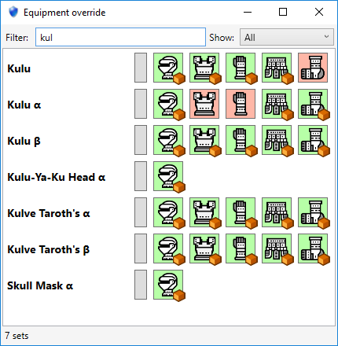

## 0.0.7.2 (2018/11/06)

- Added a certain event to the event list (fixes a issue introduced in version 0.0.7.1, sorry)

## 0.0.7.1 (2018/11/03)

- Added armor pieces data
- Improved memory consumption in some heavy cases

## 0.0.7 (2018/10/30)

- For PC players, you can now import jewels from your save data! 

    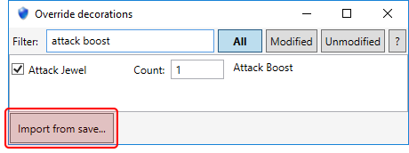

    If you have more than one save data slot (either on the same account or across accounts) then a selector shows up for you to choose where to import from.

    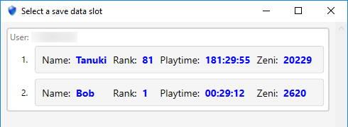

- Take a screenshot of a specific armor set search result 

    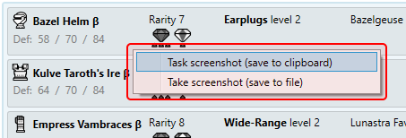

    - You can take directly to clipboard, very useful to quickly paste to a chat, email or image editor
    - You can also save it disk as PNG for later use

- Now it is possible to filter equipments in the equipment window by also typing skill name or description 

    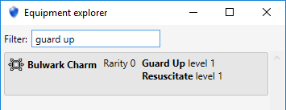

## 0.0.6.4 (2018/10/11)

This release contains optimizations that may not be perceivable for users with powerful computers. 
Hereafter are perceivable changes:

- Auto-update is now available. Right-click on the red text when it appears for options 

    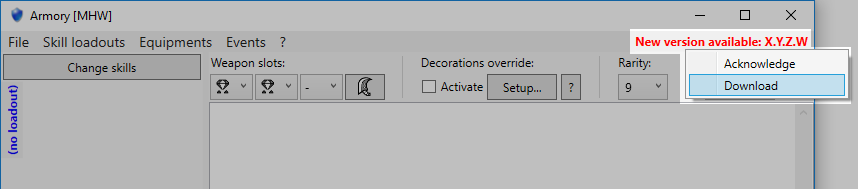

    - `Acknowledge` will simply hide the message until another version gets available
    - `Download` will download the new version in the background and open the archive for you when done

- Added Harvest armors and event
- Added another equipment selection condition that should result in more armor sets finding (but may also increase search time)
- Events window now have select all, unselect all and inverse selection buttons too
- Added a button to reset to the default selection in the advanced search window 

    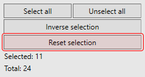

- Bug fixes (especially crashes when using the auto-search feature)

## 0.0.6.3 (2018/10/02)

This release contains mostly internal re-organization changes, not directly visible. 
From the end-user's perspective, here are the minor changes:

- Now armor set search has a progress bar
- Weapons tree can now be panned with mouse left button drag
- Updated general description of all skills
- Added skill general description to skill tooltips for even more context: 

    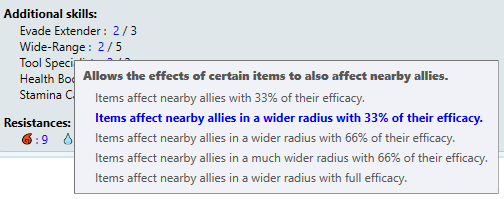

- Improved integrated help, now showing on first run of **Armory**.
- Moved skill loadouts menus 

    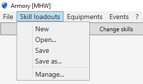

## 0.0.6.2 (2018/09/27)

- Better skill tooltips

    - Before: 

    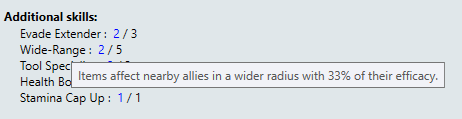

    - After: 

    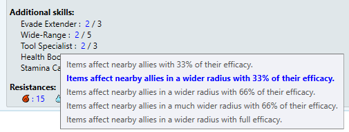

- Keyboard shortcut to add alpha, beta and gamma symbols (+ integrated help)
- Now events are activated by default

## 0.0.6.1 (2018/09/25)

- Added help window with decorations override explanation 

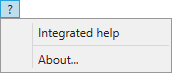

- Added select all, unselect all and inverse selection buttons in advanced search window

## 0.0.6 (2018/09/25)

- Added the weapons window
    - It allows you to check which weapon matches the currently selected weapon slots
    - It supports Handicraft and Free Element skills, and also slot augmentations

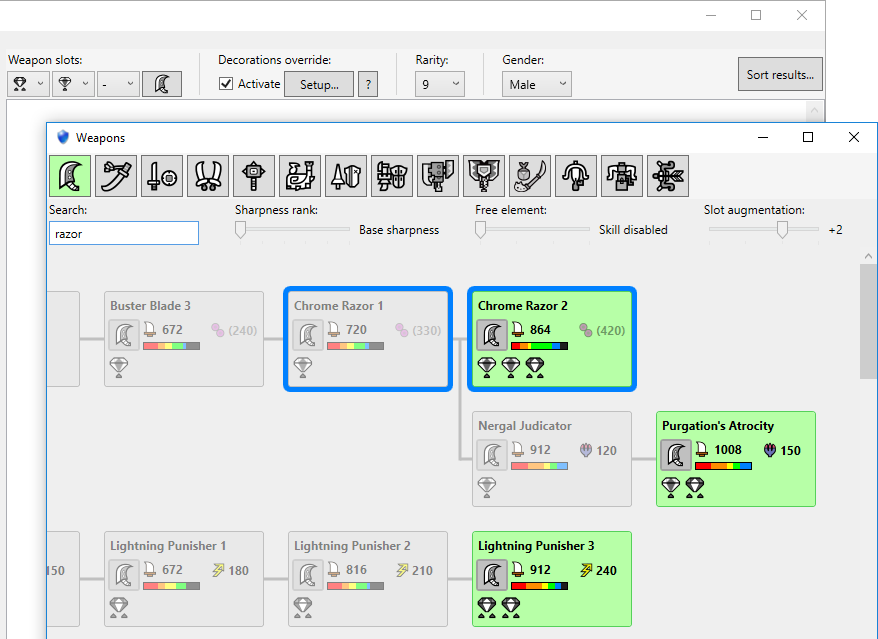

- The default sorting is now by augmented defense, then by additional skill count, then by spare slot count
- Now skills exceeding the max skill capacity are displayed in red in the armor set search results
- Added optimal and sub-optimal armor set sort criteria
- Added jewel count sort criteria
- Bug fixes
