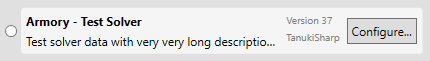

# Terminology

## Equipment

The five armor pieces (helm, chest, arms, waist, legs) are categorized as *armor pieces*. The charm is not an armor piece.<br/>
The charm is categorized as *charm level* (explanation bellow).<br/>
Armor pieces and charm are categorized as *equipment*.

A simpler hierarchical view is as follow:

- Equipment (represented by the `IEquipment` interface)
    - Armor pieces (represented by the `IArmorPiece` interface)
        - Helm
        - Chest
        - Arms
        - Waist
        - Legs
    - Charm (represented by the `ICharmLevel` interface)

### Charm specificities

A charm level (represented by the `ICharmLevel` interface) is what you may actually call a charm in the game. A charm `ICharm` represents a charm type, for example the *Attack Charm*. An `ICharmLevel` is a specific charm of this type, for example the *Attack Charm I*, *Attack Charm II* or *Attack Charm III*.

My apologize for this being confusing.

## Skill

A skill (represented by the `ISkill` interface) is actually a general skill type, for example *Attack Boost*, and a specific level of this skill is called an ability (represented by the `IAbility` interface), for example *Attack Boost level 2* or *Attack Boost level 3*.

## Decorations

Decoration and jewel terms are used interchangeably.<br/>
A jewel is represented by the `IJewel` interface. It has an array of `IAbility` in case in the future Capcom decides to create jewels that grant more than one skill. For now it is always populated with a single element.

# Understanding the default algorithm

Before implementing a solver, it is important to understand how a classic solver works.

Note that all solvers do not necessarily work the same way, the implementation is entirely up to you.

The explanations in this document are given based on the default implementation, which is a naive brute-force solving, consisting of a function that tells whether a given combination of parameters is valid or not, and then testing all the combinations against that function.

In such a solver, two aspects are important.
1. The test function must be as fast as possible.
2. The least combinations possible must be tested.

The point 2 is actually the most important, because the amount of combinations grows exponentially with the amount of equipment involved.

To give an example, with the average case where about 15 armor pieces per category (15 helms, 15 chests, etc...) and 5 charms are elected, it makes 3'796'875 combinations to test.

So because all combinations have to be tested, it is very important to minimize the amount of equipment that take place in the solving, in order to minimize the amount of combinations to test.

Classically, a solver works in 3 phases:

## Phase 1 - Reduction

This phase removes all equipment and decorations that do not match any desired skills. This is a trivial step, but very important nonetheless, because the next phase is the most complicated, so it is useful to start the next on a clean base.

## Phase 2 - Election

This phase is actually the most complicated one. Its role is to mark which equipment will really be involved in the search.

The difference with the phase 1 is that phase 1 removes equipment, whereas phase 2 does not remove anything, it simply marks the equipment that will really be used in the solving. It means that is suggests not to use some equipment, and to prefer some over some others.

This lets the user tweak which equipment he or she wants to still use, or remove anyway, through the `Advanced search` window.

Phases 1 and 2 occur during input selection, which are:
- Skill selection
- Weapon slots selection
- Decorations override
- Equipment override
- Rarity selection
- Gender selection

Phases 1 and 2 constitute what is called the **solver data**, which will be the working input of the phase 3.

## Phase 3 - Resolution

This phase will construct a collection of combinations of equipment and jewels to test, based on election done in phase 2, and naively test all combinations, keeping the ones that satisfy the user's desired skills selection.

The test function is complicated to implement as well, but it's a very mechanical and logical work, so you just have to follow many logical rules in order to get a fully functional test function.

# Fundamental rules

It is important to understand that the 3 phases of the default algorithm are not necessarily what must be done.

For example, the phase 1 removes what matches absolutely no desired skill, but you could still want to keep some equipment that match nothing, for a cosmetic purpose or any other reason that would make sense in your solver's context.

Your phase 2 could keep all equipment if you have a crazy blazing ultra fast test function. In such a case, why bother electing.

The only rules you have to respect are:
1. Creation of the solver data *(happens before the search and lets the user tweak stuffs)*
2. Finding solution to desired skills *(happens during the search)*

The rule 1 just described above is the phases 1 and 2 of the default algorithm.
The rule 2 is the phase 3.

# Implementing a solver

Here the term solver is used to describe both the solver data and the solver.

All types you will need in order to implement a custom solver are located in assemblies `MHArmory.Search.Contracts` and `MHArmory.Core`, and you mainly have to implement two interfaces, `ISolverData` and `ISolver`.

For a logical understanding purpose, the `ISolver` interface is being described before the `ISolverData` interface. Note that in the timeline of events, and even in construction of all the bricks, the `ISolverData` comes first, since it ends up being the input of the `ISolver`.

## Fundamental types

### IExtension

Hereafter is the `IExtension` interface:

```cs
public interface IExtension
{
    string Name { get; }
    string Author { get; }
    string Description { get; }
    int Version { get; }
}
```

- `Name`: The name of the extension. It has to be unique among other extensions included in **Armory**. It is recommended to make it a bit verbose in order to avoid possible confusion with other extensions.

- `Author`: The name of the extension author. Either your real name, or the name of your GitHub account, or a pseudonym, up to you.

- `Description`: The description of the extension, can be used to describe the nature of the algorithm.

- `Version`: This property is purely descriptive and no rules are enforced. Simply avoid going decrementing or changing things without incrementing the version. Don't be afraid to reach crazy high version number if needed.

### ISolver

Hereafter is the `ISolver` interface:

```cs
public interface ISolver : IExtension
{
    event Action<double> SearchProgress;

    Task<IList<ArmorSetSearchResult>> SearchArmorSets(
        ISolverData solverData,
        CancellationToken cancellationToken
    );
}
```

- `SearchProgress` event<br/>
    This event is used to report the solver's progression when running. This event can be raised from any thread. The value to raise has to be in range 0.0 to 1.0 included.

- `SearchArmorSets` method<br/>
    This method receives the solver data, and a cancellation token that indicates the algorithm when to stop because the user requested a cancellation.<br/>
    This method has to run asynchronously, and upon completion must return a collection of armor set search results.

### ArmorSetSearchResult

This structure is returned by the `SearchArmorSets` method of the `ISolver` interface, and is described as follow:

*(The design of this structure has many problems and may change in the future, but very slightly).*

```cs
public struct ArmorSetSearchResult
{
    public static readonly ArmorSetSearchResult NoMatch =
        new ArmorSetSearchResult { IsMatch = false };

    public bool IsMatch;
    public IList<IArmorPiece> ArmorPieces;
    public ICharmLevel Charm;
    public IList<ArmorSetJewelResult> Jewels;
    public int[] SpareSlots;
}
```

The static property `NoMatch` is used by the test function of the default algorithm to return when the input parameters do not satisfy the desired skills.

The `IsMatch` property has to be set to true when a set of equipment and jewels satisfies the desired skills.

When this is the case, the properties `ArmorPieces` and `Charm` have to be set, as well as the `Jewels` property. The latter is not a collection of `IJewel`, but a collection of `ArmorSetJewelResult` (described later in this document).

Finally, you have to set the `SpareSlots` property. This has to be a array of N elements where N is the maximum slot size. For the moment it's 3. The value at index `i` indicates the amount of spare slots of size `i + 1`.<br/>
For example, the value at index 2 indicates the amount of spare slots of size 3.
A value `[2, 0, 1]` indicates there are 2 spare slots of size 1, and 1 spare slot of size 3.

### ISolverData

Hereafter is the `ISolverData` interface:

```cs
public interface ISolverData : IExtension
{
    int[] WeaponSlots { get; }

    ISolverDataEquipmentModel[] AllHeads { get; }
    ISolverDataEquipmentModel[] AllChests { get; }
    ISolverDataEquipmentModel[] AllGloves { get; }
    ISolverDataEquipmentModel[] AllWaists { get; }
    ISolverDataEquipmentModel[] AllLegs { get; }
    ISolverDataEquipmentModel[] AllCharms { get; }
    SolverDataJewelModel[] AllJewels { get; }
    IAbility[] DesiredAbilities { get; }

    void Setup(
        IList<int> weaponSlots,
        IEnumerable<IArmorPiece> heads,
        IEnumerable<IArmorPiece> chests,
        IEnumerable<IArmorPiece> gloves,
        IEnumerable<IArmorPiece> waists,
        IEnumerable<IArmorPiece> legs,
        IEnumerable<ICharmLevel> charms,
        IEnumerable<SolverDataJewelModel> jewels,
        IEnumerable<IAbility> desiredAbilities
    );
}
```

The `Setup` method will be called each time the user changes input selection in **Armory**, with the following arguments:

- `weaponSlots`<br/>
    The slots of the weapon, always containing the maximum amount of slots. For the moment, the maximum amount of slots is 3, so this array will always contain 3 elements. Each element represent the size of the slots. 0 means the slot is unused, 1 means this is slot size 1, 2 for a slot size 2 and 3 for a slot size 3.<br/>
    For example, if you selected a slot 3 and a slot 1, the `weaponSlots` array would be `[ 3, 1, 0 ]`.

- `heads`, `chests`, `gloves`, `waists`, `legs`, `charms`<br/>
    Those arguments contain the equipment that match the user selection, so they depend if the user selected `Equipment override` or not, and if yes, what the user selected as owned.<br/>
    Note that the `charms` argument is a collection of `ICharmLevel` instances.

- `jewels`<br/>
    This argument provides you the available jewels that match the user selection, so they depend if the user selected `Decorations override` or not, and if yes, what the user selected as owned. It also tells you how many of each are available.<br/>
    Note that if the user didn't override a decoration, the amount is set to `int.MaxValue` so your algorithm doesn't really need a special path to handle an infinite amount of jewels.

- `desiredAbilities`<br/>
    This argument provides you the core data of the very purpose of an armor set search application, the desired skills the user want to get once everything equipped.<br/>
    It informs you about which skills the user wants, and for each skill, which level of that skill is desired.

The properties you have to implement are all read-only, and explained as follow:

- `WeaponSlots`<br/>
    This is essentially what you receive as `weaponSlots` input parameter from the `Setup` method.

- `AllHeads`, `AllChests`, `AllGloves`, `AllWaists`, `AllLegs`, `AllCharms`<br/>
    Those properties will inform the UI of which equipment have been kept, and among those ones, which ones have been elected.

- `AllJewels`<br/>
    This is the remaining jewels you want to keep and pass to the solver.

- `DesiredAbilities`<br/>
    Same as the weapon slots, this is essentially what you received as input parameter `desiredAbilities` from the `Setup` method.

### Extension types

Note that both `ISolverData` and `ISolver` interfaces inherit from `IExtension`. For your implementations to be registered in the application, you have to add an instance of them to the `MHArmory.AvailableExtensions.*` arrays.

It has been decided not to allow dynamic code execution, hence extensions have to be built-in. This allows people to review the code that is going to be embedded, an protect users from possible malicious code execution on their machine.

### IConfigurable

Optionally, you can have your `ISolverData` or `ISolver` implementation to inherit from `IConfigurable` in order to get a *Configure* button.



Hereafter is the `IConfiguration` interface:

```cs
public interface IConfigurable
{
    void Configure();
}
```

As you can see, it is extremely simple. **Armory**'s responsibility is just to make a button available, and call the `Configure` method upon button click, nothing else.

All that happens when this button is clicked is up to you. For this purpose, many types and UI related components have been moved to assembly `MHArmory.Core.WPF` for you to easily add a configuration window, benefiting from all the good stuffs of the [MVVM](https://en.wikipedia.org/wiki/Model%E2%80%93view%E2%80%93viewmodel) pattern.

## Additional types

Along the way, you could notice additional types, such as:
- `ISolverDataEquipmentModel`<br/>
    This interface is exceptional, this is the only one (with `IConfiguration` maybe) that is not only solver-specific, and is used to glue the UI and the solver data, for the user to be able to communicate custom equipment election.

- `SolverDataJewelModel`<br/>
    This is what you receive as input in the `Setup` method of the `ISolverData` interface. It associates a jewel (represented by the `IJewel` interface) with the amount of this jewel.

- `IAbility`<br/>
    This interface represents a single level of a skill. For example, for the skill *Attack Boost*, what is called an ability is a level of this skill, so for example *Attack Boost level 3*.

- `ArmorSetJewelResult`<br/>
    This type is a structure and represent a tuple value, jewel plus the amount of this same jewel. Somewhat similar with the `SolverDataJewelModel` class, but used only in the search results.

- `ArmorSetSearchResult`<br/>
    This type is a structure used by the solver to communicate a search result. It contains the matching armor pieces, charm, and jewels. It also indicates spare slots.
