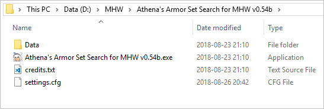
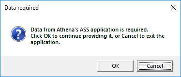

# MH Armory

## Préambule

**Armory** est un programme de recherche d'ensemble d'armure, ou plus communément appelé en Anglais, un Armor Set Search (ASS).

Pour le moment, **Armory** requiert les données de l'excellent `Athena's ASS` pour fonctionner. Ceci changera à l'avenir.
Ne souhaitant pas "voler" les données de `Athena's ASS`, vous devez télécharger cet outil vous-même, puis simplement renseigner l'endroit où se trouvent ces données à **Armory**.

Si vous ne connaissez pas `Athena's ASS`, il n'est jamais trop tard, vous pouvez le trouver ici: [https://sabercathost.com/folder/70912/MHW](https://sabercathost.com/folder/70912/MHW)

**Armory** ne supporte que `Monster Hunter: World`.

## Lancer Armory

Pour commencer, téléchargez `Athena's ASS` et extrayez-le où bon vous semble.
Admettons que vous l'ayez mis dans `D:\MHW\Athena's Armor Set Search for MHW v0.54b` comme ci-dessous, pour l'exemple.

Ensuite, téléchargez le fichier zip de **Armory** à l'adresse suivante: [https://github.com/TanukiSharp/MHArmory/raw/master/Distributions/MHArmory_0.0.3.2.zip](https://github.com/TanukiSharp/MHArmory/raw/master/Distributions/MHArmory_0.0.3.2.zip)

Extrayez le zip à un endroit où l'application aura droit en écriture, pour que le programme puisse sauvegarder vos préférences. Ceci n'est pas obligatoire, mais recommandé.
Evitez `Program Files` ou autres.

Une fois extrait, vous devriez avoir quelque chose comme ceci:

Désormais, vous pouvez exécuter `MHArmory.exe`.
Une boite de dialogue devrait apparaître, comme ceci:

Vous pouvez cliquer sur `Cancel` pour annuler, ceci fermera l'application.
Cliquez sur `OK` pour continuer.

Ensuite, une autre boite de dialogue vous demande l'emplacement du dossier de données de `Athena's ASS`, comme ceci:

Vous pouvez sélectionner le dossier `Athena's Armor Set Search for MHW vX` (exemple sur l'image ci-dessus) ou le sous-dossier `Data`.

Ensuite cliquez sur `OK` et c'est fini, vous pouvez utiliser **Armory**.
Cette manipulation n'est à faire qu'une seule fois.
